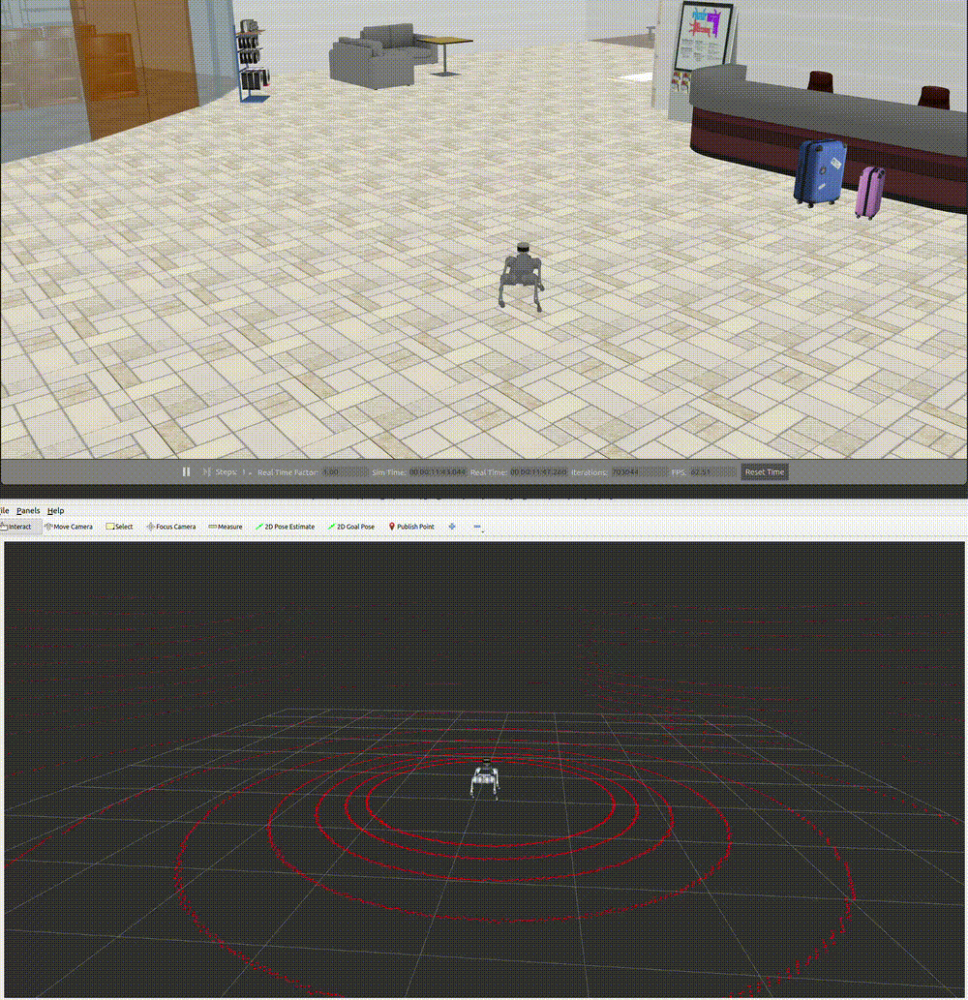

# Quadruped Robot Navigation in Gazebo

This repository integrates reinforcement learning (RL), navigation, and simulation to enable autonomous navigation for the Unitree Go2, Go2W and B2 quadruped robots in Gazebo.

## Overview

<p align="center">
  
  
</p>

This project follows a Sim-to-Sim approach, executing controllers trained in Isaac Lab within the Gazebo simulator. The virtual Unitree Go2, Go2W and B2 robots are equipped with a LiDAR. The mounting position of the Velodyne VLP16 LiDAR is based on the [Unitree developer documentation](https://support.unitree.com/home/en/developer/SLAM%20and%20Navigation_service).

## Prerequisites

Before you begin, ensure you have the following dependencies installed:

1.  **ROS 2 Humble:** Please follow the official installation instructions.


2.  **Required ROS 2 Packages:**
    ```bash
    sudo apt update && sudo apt install -y \
      ros-humble-teleop-twist-keyboard \
      ros-humble-ros2-control \
      ros-humble-ros2-controllers \
      ros-humble-control-toolbox \
      ros-humble-robot-state-publisher \
      ros-humble-joint-state-publisher-gui \
      ros-humble-gazebo-ros2-control \
      ros-humble-gazebo-ros-pkgs \
      ros-humble-xacro \
      ros-humble-navigation2 \
      ros-humble-nav2-bringup \
      ros-humble-octomap-ros\
      ros-humble-octomap-rviz-plugins\
      ros-humble-velodyne-laserscan

    ```

3.  **LibTorch (C++):**
    ```bash
    # Choose a directory to store the library
    mkdir -p ~/libs && cd ~/libs
    wget https://download.pytorch.org/libtorch/cpu/libtorch-cxx11-abi-shared-with-deps-2.0.1%2Bcpu.zip
    unzip libtorch-cxx11-abi-shared-with-deps-2.0.1+cpu.zip
    rm libtorch-cxx11-abi-shared-with-deps-2.0.1+cpu.zip
    echo 'export Torch_DIR=$HOME/libs/libtorch' >> ~/.bashrc
    source ~/.bashrc
    ```

4.  **yaml-cpp and lcm:**
    ```bash
    sudo apt install -y liblcm-dev libyaml-cpp-dev
    ```

## Installation

1.  **Clone the Repository:**
    Create a ROS 2 workspace and clone this repository recursively.
    ```bash
    mkdir -p ~/ros2_ws/src && cd ~/ros2_ws/src
    git clone https://github.com/RCILab/RCI_quadruped_robot_navigation --recursive
    ```

2.  **Build the Workspace:**
    Install dependencies and build the packages.
    ```bash
    cd ~/ros2_ws
    colcon build --symlink-install
    ```

3.  **Source the Environment:**
    Source the workspace's setup file to make the packages available in your environment.
    ```bash
    echo "source ~/ros2_ws/install/setup.bash" >> ~/.bashrc
    source ~/.bashrc
    ```


## Usage

Follow these steps to launch the simulation and control the robot. Each command should be run in a new terminal.

1.  **Launch Gazebo & RViz2:**
    This command starts the Gazebo simulation with the robot model and launches RViz2 for visualization.
    *   Default robot is `go2`.
    *   Use the `rname` argument to switch to another robot like `go2w`.

    ```bash
    # Launch with the default Go2 robot
    ros2 launch rl_sar gazebo.launch.py

    # Launch with the Go2W robot
    ros2 launch rl_sar gazebo.launch.py rname:="go2w"

    # Launch with the Go2W robot
    ros2 launch rl_sar gazebo.launch.py rname:="b2"
    ```

2.  **Run the RL Controller:**
    This node is responsible for the robot's locomotion control.
    ```bash
    ros2 run rl_sar rl_sim
    ```

3.  **Run the Action Client:**
    This client sends high-level commands or goals to the controller.
    ```bash
    ros2 run rl_action command
    ```
    
4. Execute Navigation (Nav2)
  4.1 Convert Velodyne PointCloud2 -> LaserScan (/scan)
  ```bash
  ros2 run velodyne_laserscan velodyne_laserscan_node --ros-args \
    -r velodyne_points:=/velodyne_points \
    -r scan:=/scan
  ```
  4.2 Launch Nav2
  ```bash
  ros2 launch rl_sar nav2.launch.py
  ```
5. **Elevator Control (Optional Feature)** 
    This repository includes a Gazebo **Elevator Plugin** to simulate multi-floor vertical transport. 
    See below for detailed usage instructions.

    [elevator_operation.webm](https://github.com/user-attachments/assets/0f1b5e62-1e6d-4f18-85f2-8dacea8a14e9)

    #### Elevator Plugin Usage

    This plugin allows you to simulate an elevator system inside the Gazebo environment using ROS 2 topics. 
    The elevator supports floor indexing, precise height targeting, and door open/close commands.

    #### Topics

    Assuming `<namespace>/ = /lift1`:

    **Commands**
    - `/lift1/cmd_floor` (`std_msgs/Int32`): floor index (0-based) from `<floor_heights>`
    - `/lift1/cmd_z` (`std_msgs/Float64`): absolute target height in meters
    - `/lift1/door_open` (`std_msgs/Bool`): `true` = open, `false` = close

    **Status**
    - `/lift1/cabin_z` (`std_msgs/Float64`): measured cabin Z
    - `/lift1/door_pos` (`std_msgs/Float64MultiArray`): `[right, left]` joint positions

    #### Examples

    <details>
    <summary>Click to expand</summary>

    ```bash
    # Move by floor index
    ros2 topic pub /lift1/cmd_floor std_msgs/msg/Int32 "{data: 0}"
    ros2 topic pub /lift1/cmd_floor std_msgs/msg/Int32 "{data: 1}"
    ros2 topic pub /lift1/cmd_floor std_msgs/msg/Int32 "{data: 2}"

    # Move to absolute height (meters)
    ros2 topic pub /lift1/cmd_z std_msgs/msg/Float64 "{data: 3.0}"

    # Open / close doors
    ros2 topic pub /lift1/door_open std_msgs/msg/Bool "{data: true}"
    ros2 topic pub /lift1/door_open std_msgs/msg/Bool "{data: false}"

    # Monitor
    ros2 topic echo /lift1/cabin_z
    ros2 topic echo /lift1/door_pos
    ```
    
6. **Door Control (Optional Feature)**  
    This repository includes a Gazebo **Door Plugin** and a Behavior-Tree-based **Door Controller** to control doors in the simulated building via ROS 2.
    

    The environment contains **37 doors** in total, with the following types:
    
    - Single hinged doors  
    - Single sliding doors  
    - Double hinged doors  
    - Double sliding doors  
    
    All doors share the **same topic interface**; only the **namespace** changes (e.g., `/L1_door1`, `/L1_door2`, `/L2_door5`, ...).
    
    <details>
    <summary>Click to expand</summary>
        
    #### 5.1 Door Plugin Usage
    
    Each door is controlled by a dedicated namespace.  
    Below is an example for the door with namespace `/L1_door1`:
    
    #### Topics
    
    **Commands**
    - `/L1_door1/door_open` (`std_msgs/Bool`):  
      - `true`  → open the door  
      - `false` → close the door  
    
    **Status**
    - `/L1_door1/door_pos`: current door joint position(s)  
      - For double doors, this typically represents both leaves (e.g., `[right, left]`).
    
    #### Example Commands
    ```bash
    # Open / close a door (L1_door1)
    ros2 topic pub /L1_door1/door_open std_msgs/msg/Bool "{data: true}"
    ros2 topic pub /L1_door1/door_open std_msgs/msg/Bool "{data: false}"
    
    # Monitor door joint position(s)
    ros2 topic echo /L1_door1/door_pos
    ```
    To control **any other door**, simply replace L1_door1 with the corresponding door namespace
    (e.g., `/L1_door2`, `/L1_door_stairs1`, `/L1_door_toilet`, `/L2_door3`, etc.).

    ---
    ### 5.2 Behavior Tree-Based Automatic Door Control
    
    In addition to manual topic-based control, this repository provides a **Behavior Tree (BT)** node that automatically opens and closes doors along the robot’s planned path.
   

    --- 
    #### Supported Doors (Current Setup)
    
    The BT-based door controller is currently configured for the following 1st-floor doors:
    
    - `/L1_door_stairs1`
    - `/L1_door_stairs2`
    - `/L1_door_toilet`
    
    All these doors use the same topic interface as in **5.1** (only the namespace changes).
    
    --- 
    #### Node Execution
    Run the BT door controller with:
    ```bash
    ros2 run door_bt door_bt_runner
    ```
    Make sure the simulation and navigation stack are running, and that the door plugins for the above namespaces are loaded in the world.

   ---
    ### Path Topic
    The BT node subscribes to the planned path topic:    
    - `/plan`
      
    This topic should contain the robot’s planned path (e.g., from a global planner) so that the BT can determine whether the path passes through any controlled doors.

    ---
    ### Behavior
    When the planned path passes through one of the configured doors:
    
    The BT **automatically opens** the door (via <door_namespace>/door_open) before the robot reaches it. 
    After the robot has passed the door, the BT **automatically closes** it.

   This allows the robot to traverse routes that include doors without any manual `ros2 topic pub` commands.

7. **Stair locomotion (Optional Feature)**

   #### 6.1 How it works (high-level behavior)
    
   Once the Stair Behavior Tree (BT) is running, the robot follows this flow:
    
   1. **Wait for a target floor request**
      The BT keeps waiting for a message on `/stairs/floor_request`.

   2. **Read the current floor**
      When a target floor is received, the BT estimates the robot’s current floor (e.g., from robot pose / height in the world frame).
    
   3. **Decide what to do (up / down / stay)**  
      - `target_floor > current_floor` → **go up**
      - `target_floor < current_floor` → **go down**
      - `target_floor == current_floor` → **no movement (already on target floor)**
    
   4. **Navigate to the stair entry**  
      The BT selects the appropriate stair entry pose for the current step and navigates there using Nav2.
    
   5. **Align and execute stair locomotion**  
      The robot aligns itself with the stairs, performs stair locomotion (mid/top), and runs the landing motions (move/turn) as configured.
    
   6. **Multi-floor moves (repeat per floor)**  
      If the target floor is more than one level away, the BT repeats the “one-floor stair step” sequence until it reaches the target floor.
   ---
   #### 6.2 Node execution & command description 
   #### (1) Start Nav2 bringup
   ```bash
   ros2 launch quadruped_nav2 quadruped_nav2_bringup.launch.py
   ```
   - Launches Nav2-related nodes for path planning and navigation.
   - Used to move the robot to the stair entry pose before starting stair locomotion.
    
   #### (2) Run the Stair BT
   ```bash
   ros2 run stair_bt stair_bt_runner --ros-args -p bt_xml_file:="$(ros2 pkg prefix stair_bt)/share/stair_bt/bt_trees/stairs.xml"
   ```
   - Runs the stair locomotion Behavior Tree.
   - The BT waits for `/stairs/floor_request` and, once received, executes the stair locomotion sequence.
    
   #### (3) Publish a target floor request
   ```bash
   ros2 topic pub /stairs/floor_request std_msgs/msg/Int32 "{data: 1}"
   ```
   - Sends the target floor as a trigger.
   - Example above requests **floor 1**.
    

## Example: Teleoperation Control

This example demonstrates how to control the robot's movement using keyboard commands.

1.  **Activate the Robot:**
    In the terminal where you launched the `rl_action command` node, enter the following commands to activate the robot and enable navigation mode:
    ```bash
    (csuite) activation true
    (csuite) navigation true
    ```

2.  **Launch Keyboard Teleoperation:**
    Open a **new terminal** and run the `teleop_twist_keyboard` node to control the robot with your keyboard.
    ```bash
    ros2 run teleop_twist_keyboard teleop_twist_keyboard
    ```
    You can now move the robot using the capital keys displayed in the terminal (e.g., `U`, `I`, `O`, `J`, `K`, `L`, `M`, `<`, `>`)

3.  **Deactivate the Robot:**
    When you are finished, deactivate the robot and exit the command interface by returning to the `rl_action` terminal and entering:
    ```bash
    (csuite) activation false
    (csuite) quit
    ```

## Docker
1. **Pull docker image**
  ```bash
  docker pull agbread/my_ros2_gz11:latest
  ```
2. **Run Docker container (GPU + Gazebo GUI)**
  ```bash
  docker run -it \
  --gpus all \
  --network host \
  --ipc host \
  -e NVIDIA_VISIBLE_DEVICES=all \
  -e NVIDIA_DRIVER_CAPABILITIES=compute,utility,graphics,display \
  -e DISPLAY=$DISPLAY \
  -e XAUTHORITY=$XAUTHORITY \
  -e QT_X11_NO_MITSHM=1 \
  -v /tmp/.X11-unix:/tmp/.X11-unix:rw \
  -v $XAUTHORITY:$XAUTHORITY:ro \
  --name gz11_gui \
  agbread/my_ros2_gz11:latest \
  bash
  ```
  
  **Verify X11 environment variables (required for GUI applications)**
  ```bash
  echo $DISPLAY
  echo ${XAUTHORITY:-$HOME/.Xauthority}
  ```

## TodoList 

1. **Navigation integration**  
   - Add navigation capability using either the `Nav2` package or by integrating with [unitree_go2_nav](https://github.com/Sayantani-Bhattacharya/unitree_go2_nav)

2. **OpenRMF support**  
   - Incorporate [Open-RMF](https://www.open-rmf.org/) functionality for fleet and task management


3. **RL model update**  
   - Modify reinforcement learning to account for LiDAR weight

## License

This project is licensed under the **MIT License**. See the [LICENSE](LICENSE) file for details.

In addition, the following components are based on forked repositories with modifications:

- Controller module is forked and adapted from [fan-ziqi/rl_sar](https://github.com/fan-ziqi/rl_sar)  

This component follows the license of the original repository.


## Contact

**Maintainer:** Sanghyun Kim (`kim87@khu.ac.kr`)

**Lab:** [RCI Lab @ Kyung Hee University](https://rcilab.khu.ac.kr)
