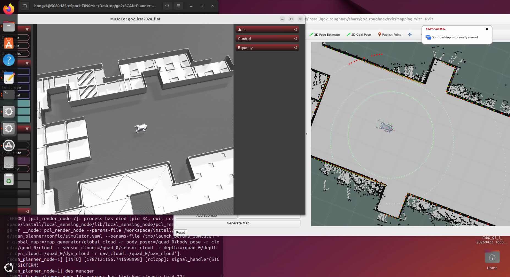

# Unitree Go2 自主导航与巡检实验平台

本仓库是面向 **Unitree Go2 EDU** 的 ROS 2 导航、局部规划、仿真与真机实验工作区，当前主要用于室内建图、自主导航、门禁/电梯任务和后续自主巡检研究。

> 项目包含多个开源工程的二次开发与集成。原始算法、模型和工程的著作权归各上游作者所有，使用和分发时请同时遵守各子目录中的许可证与署名要求。

## 已完成内容

- Go2 EDU 自带点云的读取与 `PointCloud2 -> LaserScan` 转换；
- 基于 `slam_toolbox` 的室内建图和地图保存；
- 基于 AMCL 与 Nav2 的真机定位、全局规划和局部避障；
- Go2 速度指令桥接、限速和指令超时保护；
- Gazebo 中的 Go2 导航、门禁、电梯与行为树任务；
- SCAN-Planner 原版以及 ROS 2 Humble 移植版；
- ARM64/Humble Docker 真机部署、传感器自检和 RViz 配置。

## 效果展示

### Go2 EDU 建图



### 自主导航

[WebM 演示](go2导航.webm) · [MP4 演示](go2导航.mp4)

### 门禁与电梯仿真

[WebM 演示](go2门禁电梯.webm) · [MP4 演示](go2门禁电梯.mp4)

## 目录结构

| 目录 | 用途 |
| --- | --- |
| `go2-nav2-amcl-main/` | Go2 真机驱动、点云处理、SLAM、AMCL 和 Nav2 导航主线 |
| `RCI_quadruped_robot_navigation-main/` | Gazebo 四足机器人仿真、Nav2、门、电梯与行为树 |
| `SCAN-Planner-Ros2/` | SCAN-Planner 的 ROS 2 Humble 移植与测试工程 |
| `SCAN-Planner/` | 上游 ROS 1 SCAN-Planner 参考实现 |
| `Unitree_Go2-main/` | Go2 复杂地形运控、训练、MuJoCo 仿真及相关工具 |

如果目标是复现真机建图和导航，建议从 [`go2-nav2-amcl-main/README.md`](go2-nav2-amcl-main/README.md) 和 [`go2-nav2-amcl-main/docs/真机部署.md`](go2-nav2-amcl-main/docs/真机部署.md) 开始。

## 软硬件环境

### 真机主线

- Unitree Go2 EDU（使用机载点云和位姿话题）；
- Ubuntu 22.04 + ROS 2 Humble；
- 宇树官方 `unitree_ros2`、Cyclone DDS；
- Nav2、slam_toolbox、robot_localization 等 ROS 2 依赖；
- 有线网络连接 Go2，或在 ARM64 设备中使用项目提供的 Humble 容器。

### 仿真与运控

不同子项目分别使用 Gazebo、MuJoCo、Isaac Lab、ROS 1 Noetic 或 ROS 2 Humble，不建议在同一工作空间中一次性编译所有子项目。请依照相应子目录的 README 单独配置。

## 真机快速开始

### 1. 准备 ROS 2 环境

```bash
source /opt/ros/humble/setup.bash
source ~/unitree_ros2/cyclonedds_ws/install/setup.bash
export RMW_IMPLEMENTATION=rmw_cyclonedds_cpp
```

### 2. 编译真机工作空间

```bash
cd go2-nav2-amcl-main
colcon build --symlink-install
source install/setup.bash
```

### 3. 上电后做只读检查

```bash
bash tools/go2_real_preflight.sh
ros2 topic echo /utlidar/robot_pose --once
```

常见点云话题为 `/utlidar/cloud_deskewed` 或 `/utlidar/cloud`，以实际固件发布的话题为准。

### 4. 建图

```bash
ros2 launch go2_core go2_real_slam.launch.py
ros2 run teleop_twist_keyboard teleop_twist_keyboard
mkdir -p ~/go2_maps
ros2 run nav2_map_server map_saver_cli -f ~/go2_maps/site_map
```

如果点云话题为 `/utlidar/cloud`：

```bash
ros2 launch go2_core go2_real_slam.launch.py input_topic:=/utlidar/cloud
```

### 5. 加载地图导航

```bash
ros2 launch go2_navigation2 go2_real_nav.launch.py \
  map:=$HOME/go2_maps/site_map.yaml
```

在 RViz 中先使用 `2D Pose Estimate` 设置初始位姿，再发送 `Nav2 Goal`。

## 毕业设计扩展方向

当前平台可继续扩展为室内自主巡检系统：

1. 巡检点配置、优先级和多目标调度；
2. 巡检点到达判断、精确停靠和数据采集；
3. 基于障碍距离、路径曲率和定位状态的自适应速度控制；
4. 停滞检测、重规划、重试、跳过和任务恢复；
5. 巡检轨迹、异常事件与报告生成；
6. 在 Gazebo 中扩展门禁、电梯和多楼层任务验证。

## 分支说明

- `main`：综合项目与仿真开发主线；
- `real`：Go2 EDU 真机感知、SLAM、Nav2 和 ARM64 部署主线。

## 安全提示

- 首次下发运动指令前，先在悬空或开阔环境中低速测试；
- 真机运行期间始终保留宇树遥控器的急停权限；
- 确认点云、时间戳、`/odom -> base_link` 和雷达 TF 正常后，再启用 Nav2；
- 不要直接将仿真中的速度、尺寸或传感器外参用于真机。

## 上游项目与致谢

本仓库基于或参考了 Unitree ROS 2、Nav2、slam_toolbox、robot_localization、FishPlusDragon/unitree-go2-slam-toolbox、RCILab/RCI_quadruped_robot_navigation 和 SCAN-Planner 等开源项目。感谢原作者和开源社区的工作。

