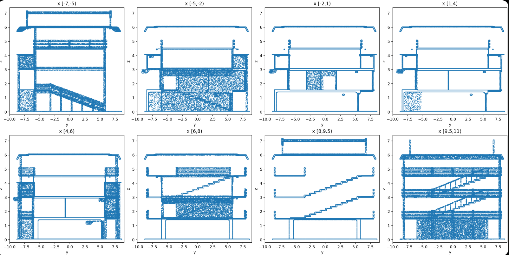

<div align="center">
  <h1>SCAN-Planner ROS 2</h1>
  <h2>面向路线引导四足长程导航的空间碰撞感知局部规划器</h2>
</div>

<p align="center">
  
</p>
<p align="center">
  
</p>
<p align="center">
  
</p>
<p align="center">
  
</p>

> 二编：增加一个map.pcd，并提供测试例子（非搭建gazebo测试）

SCAN-Planner 是一款面向四足机器人导航的空间碰撞感知局部规划器。本分支是原生 ROS 2 自移植版本，适配 Ubuntu 22.04、ROS 2 Humble、C++17 和 `colcon` 构建系统。

本仓库是 [wuyi2121/SCAN-Planner](https://github.com/wuyi2121/SCAN-Planner) 的衍生 ROS 2 移植版。核心算法、项目设计与原始研究工作归功于 Han Zheng、Zhe Chen、Yiwen Fu、Ming Yang 和 Tong Qin；ROS 2 适配由本仓库维护者完成。


## 构建

安装 ROS 2 Humble 及包依赖后，在工作空间根目录下执行构建：

```bash
sudo apt update
rosdep update
rosdep install --from-paths src --ignore-src -r -y
sudo apt install libarmadillo-dev libglew-dev libglfw3-dev libgl1-mesa-dev libglu1-mesa-dev

colcon build --symlink-install --cmake-args -DCMAKE_BUILD_TYPE=Release
source install/setup.bash
```

默认构建 CPU 端本地感知后端，如需构建 OpenGL 后端可执行：

```bash
colcon build --symlink-install --cmake-args -DCMAKE_BUILD_TYPE=Release -DUSE_GPU=ON
```
仓库不再链接自带的 x86_64 架构 GLFW 动态库，GPU 构建依赖系统安装的 GLFW、GLEW 和 OpenGL 相关包。

## 快速启动

---

### 1.1、在一个终端启动 RViz2：

```bash
source install/setup.bash
ros2 launch scan_planner rviz.launch.py
```
### 1.2、在另一个终端启动自定义确定性仿真器与规划器（Mode 1 二维闭环演示，机身高度保持不变）：

```bash
source install/setup.bash
ros2 launch scan_planner run.launch.py \
  is_real_world:=false navi_mode:=1 sensor_type:=lidar \
  controller_mode:=closed_loop use_gpu:=false
```
---


### 2.1、在一个终端启动 RViz2：

```bash
source install/setup.bash
ros2 launch scan_planner rviz.launch.py
```
### 2.2、使用 `map.pcd` 运行 Mode 3 跨层开环演示(注意替换自己的路径)：

```bash
source install/setup.bash
ros2 launch scan_planner run.launch.py \
  is_real_world:=false navi_mode:=3 sensor_type:=lidar \
  controller_mode:=open_loop use_gpu:=false \
  use_pcd_map:=true \
  pcd_map_file:=/your_map_location/map.pcd \
  reference_path_file:=/your_project_location/src/planner/plan_manage/config/reference_path.map.yaml
```

示例参考路径从 `(-5.5, 5.5, 0.10)` 沿地图坡道上升到
`(-5.5, -4.5, 1.55)`。路径文件中的 `z` 是地面/路线高度，规划器会再加上
`grid_map.body_height`（默认 `0.4 m`），因此目标机身高度约为 `1.95 m`。


RViz2 配置已适配 ROS 2 Humble：Go2 的 RobotModel 使用现有的 `meshes/base.dae`，Sliding Map Bounds 订阅 `/grid_map/sliding_map_bbox`，Goal 订阅 `/goal_point`。


### 导航模式说明
- `navi_mode:=1`：使用 RViz2 的 2D 目标点工具选择导航目标
- `navi_mode:=2`：按照 ROS 2 参数文件中预设的 `fsm.waypoints` 路径点序列导航
- `navi_mode:=3`：订阅 `initial_path` 话题获取全局路径，并在局部范围内进行避障

控制器模式分为 `open_loop`（开环）和 `closed_loop`（闭环）两种。本次移植保留的核心启动参数包括：`is_real_world`、`navi_mode`、`sensor_type`、`controller_mode`、`use_gpu`、`use_pcd_map` 和 `pcd_map_file`。

与原作者实现保持一致，`closed_loop` 通过平面 `cmd_vel` 跟踪 `x/y/yaw`，
适用于二维仿真或真机底盘接口；多楼层仿真应使用 `open_loop`，直接按规划得到的
三维 B-spline 发布里程计。Mode 3 默认从 `(-5.5, 5.5, 0.5)` 启动，Mode 1
默认从 `(-19.0, 1.0, 0.25)` 启动，仍可用 `init_x`、`init_y`、`init_z` 覆盖。

Mode 3 默认等待外部节点发布 `/initial_path`。也可以通过
`reference_path_file` 启动仓库内的演示发布器；该发布器会等待首个
`body_pose` 和规划器订阅者就绪后发布一次路径。路径至少需要两个 xyz 点，
相邻点会按三维距离 `0.5 m` 降采样，并始终保留最终点。

当 `use_pcd_map:=true` 时，必须提供已有的 PCD 点云地图文件：

```bash
ros2 launch scan_planner run.launch.py \
  use_pcd_map:=true pcd_map_file:=/absolute/path/to/map.pcd
```

实际硬件部署时，激光惯导里程计（LIO）、相机和宇树（Unitree）驱动均为外部依赖，默认启动会将规划器输入映射到 `/LIO/odom_vehicle`、`/LIO/odom_imu`、`/LIO/clouds_lidar` 话题以及 RealSense 对齐深度图话题，可根据实际安装的驱动栈修改话题重映射配置。

## 配置与接口

规划器、控制器和仿真器的参数分别位于：
- `src/planner/plan_manage/config/planner.yaml`
- `src/planner/plan_manage/config/controllers.yaml`
- `src/planner/plan_manage/config/simulator.yaml`

ROS 2 参数名称使用点号分隔，例如 `grid_map.resolution`。预设路径点是由 xyz 三元组组成的浮点数组：

```yaml
scan_planner_node:
  ros__parameters:
    fsm.navi_mode: 2
    fsm.waypoints: [0.0, 0.0, 0.3, 5.0, 1.0, 0.3]
```

自定义消息类型为 `scan_planner_msgs/msg/Bspline` 和 `scan_planner_msgs/msg/DataDisp`。规划器相关话题均为相对话题，支持重映射，核心输出话题包括 `planning/bspline`、`planning/data_display` 和 `planning/go2_execution_frozen`。

关键点记录器现在是原生的 `rclpy` 可执行程序：

```bash
ros2 run scan_planner keypoint_recorder.py --output keypoints.yaml
```

参考路径演示发布器也可以独立运行：

```bash
ros2 run scan_planner reference_path_publisher.py --ros-args \
  --params-file src/planner/plan_manage/config/reference_path.map.yaml \
  -r body_pose:=/quad_0/body_pose -r initial_path:=/initial_path
```

## Gazebo Fortress / Go2 仿真

Go2 四足机器人物理模型基于 Gazebo Fortress、`ros_gz_sim` 和 `gz_ros2_control` 构建，对外提供 12 关节的 `joint_trajectory_controller`、`/joint_states` 话题、IMU 数据、四个足端接触力话题以及 `/clock` 时钟话题：

```bash
ros2 launch go2_description go2_sim.launch.py
```

如需在不启动物理仿真时查看模型，可运行：

```bash
ros2 launch go2_description go2_rviz.launch.py
```
旧版 Gazebo Classic 的轨迹/力可视化插件、外力插件以及宇树 ROS 1 专用插件已不在本 ROS 2 仿真版本中提供。


## 致谢

首先感谢原项目 [SCAN-Planner](https://github.com/wuyi2121/SCAN-Planner) 的作者 Han Zheng、Zhe Chen、Yiwen Fu、Ming Yang 和 Tong Qin 开源其研究成果与实现。本仓库在保留原项目 Apache-2.0 许可证的前提下完成 ROS 2 移植，完整署名见 [NOTICE](NOTICE)。

SCAN-Planner 的实现借鉴了 EGO-Planner、ROG-Map、MARSIM、Mockamap 和 Leg-KILO 的算法思路与开源代码，真实机器人定位方案基于 Elevator-LIO / FAST-LIO2 实现。

## 许可证

本仓库遵循 [Apache License 2.0](LICENSE)。分发或派生本项目时，请保留 [NOTICE](NOTICE) 中的原项目署名与许可证信息。
